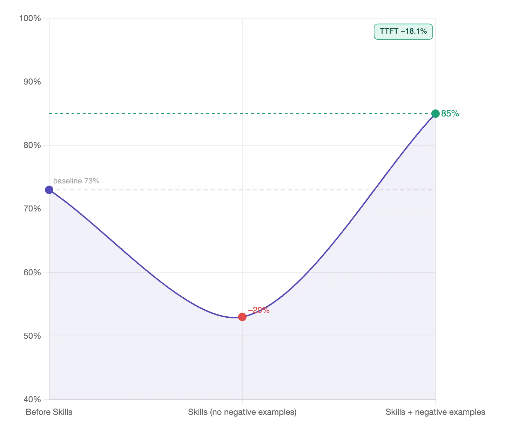

# 你不知道的 Agent：原理、架构与工程实践

摘自[你不知道的 Agent：原理、架构与工程实践 - Tw93](https://tw93.fun/2026-03-21/agent.html)

## Agent Loop 的基本运转方式

Agent Loop 的核心实现逻辑抽象后其实不到 20 行代码：

Copy

```ts
const messages: MessageParam[] = [{ role: "user", content: userInput }];

while (true) {
  const response = await client.messages.create({
    model: "claude-opus-4-6",
    max_tokens: 8096,
    tools: toolDefinitions,
    messages,
  });

  if (response.stop_reason === "tool_use") {
    const toolResults = await Promise.all(
      response.content
        .filter((b) => b.type === "tool_use")
        .map(async (b) => ({
          type: "tool_result" as const,
          tool_use_id: b.id,
          content: await executeTool(b.name, b.input),
        }))
    );
    messages.push({ role: "assistant", content: response.content });
    messages.push({ role: "user", content: toolResults });
  } else {
    return response.content.find((b) => b.type === "text")?.text ?? "";
  }
}
```

对应的控制流如下，感知 -> 决策 -> 行动 -> 反馈四个阶段不断循环，直到模型返回纯文本为止：

新能力基本只通过三种方式接入：扩展工具集和 handler、调整系统提示结构、把状态外化到文件或数据库

### Workflow 和 Agent 区别

执行路径由代码预先写死的是 Workflow，由 LLM 动态决定下一步的是 Agent

### 五种常见控制模式

大多数 AI 系统拆开看，其实都是这五种模式的组合，很多场景并不需要完整的 Agent 自主权，把其中几种模式搭起来就够了。

1. **提示链 Prompt Chaining**：任务拆成顺序步骤，每步 LLM 处理上一步的输出，中间可加代码检查点，适合生成后翻译、先写大纲再写正文这类线性流程。
2. **路由 Routing**：对输入分类，定向到对应的专用处理流程，简单问题走轻量模型，复杂问题走强模型，技术咨询和账单查询走不同逻辑。
3. **并行 Parallelization**：两种变体：分段法把任务拆成独立子任务并发跑，投票法把同一任务跑多次取共识，适合高风险决策或需要多视角的场景。
4. **编排器-工作者 Orchestrator-Workers**：中央 LLM 动态分解任务，委派给工作者 LLM，综合结果，nanobot 的 `spawn` 工具和 learn-claude-code 的子 Agent 模式都是这个原型。
5. **评估器-优化器 Evaluator-Optimizer**：生成器产出，评估器给反馈，循环直到达标，适合翻译、创意写作这类质量标准难以用代码精确定义的任务。



### 场景选择

| 场景                                   | 选什么                                    |
| :------------------------------------- | :---------------------------------------- |
| 流程固定 + 验收可代码判定              | Workflow / Prompt Chaining，不必上 Agent  |
| 输入可分类到不同分支                   | Routing                                   |
| 需要中间推理 + 验收清晰                | 单 Agent ReAct Loop                       |
| 任务可拆 + 子任务可并行 + 结论只需摘要 | Orchestrator-Workers，主 ReAct + 子 Agent |
| 质量标准难以代码化（翻译、创意）       | Evaluator-Optimizer                       |
| 高风险决策 + 需要多视角                | Parallelization 投票                      |

主 Agent 选 ReAct Loop，配上显式任务图；子 Agent 只带最小提示（Tooling、Workspace、Runtime），不带 Skills 和 Memory，避免权限外泄，也避免破坏隔离。`多 Agent 不是默认选项，先把单 Agent 上限跑出来再扩展，协调开销经常超过并行收益。`

## Harness 比模型更关键

Harness 是指围绕 Agent 构建的测试、验证与约束基础设施，这里的 Harness 至少包括四个部分：验收基线、执行边界、反馈信号和回退手段。

### Harness 的关键结论



图里用任务清晰度和验证自动化程度把任务分成四种状态，右上角目标明确、结果可以自动验证，是最适合 Agent 发挥的区域，左上角任务清楚但验收还得人盯，吞吐量天花板是人的审查速度，右下角有自动化反馈但目标模糊，系统会高效地往错误方向跑，左下角两者都缺，Agent 基本起不到作用。

## 上下文工程决定稳定性

Transformer 的注意力复杂度是 $O(n^2)$，上下文越长，关键信号越容易被噪声稀释，实践里最常见的失效模式是无关内容一旦占到上下文的大头，Agent 的决策质量就会明显下滑，这类现象通常被叫作 Context Rot。Claude Code 团队的经验是，1M context 模型上大致从 300k-400k tokens 开始出现，强依赖任务类型。

### 上下文分层



解决方式是按信息的使用频率和稳定性分层管理，每层只放自己该放的东西：

- **常驻层**：身份定义、项目约定、绝对禁止项，每次会话都必须成立的内容，**保持短、硬、可执行**
- **按需加载**：Skills 和领域知识，描述符常驻，完整内容触发时再注入，不用的不占位置
- **运行时注入**：当前时间、渠道 ID、用户偏好等动态信息，每轮按需拼入
- **记忆层**：**跨会话经验写入 `MEMORY.md`，不直接进系统提示，需要时才读取**
- **系统层**：Hooks 或代码规则处理确定性逻辑，完全不进上下文

> **别把确定性逻辑放进上下文**，凡是可以通过 Hooks、代码规则或工具约束表达的内容，都应交给外部系统处理，而不是让模型反复读取。

### 三种常见压缩策略

| 策略         | 成本 | 丢什么         | 适用场景           |
| :----------- | :--- | :------------- | :----------------- |
| 滑动窗口     | 极低 | 早期上下文     | 简短对话           |
| LLM 摘要     | 中   | 细节，保留决策 | 长任务、含关键决策 |
| 工具结果替换 | 极低 | 工具原始输出   | 工具调用密集型     |

### 会话管理的五种分支

压缩只是被动兜底，Claude Code 团队还给过五种主动管理方式：

- **continue**：继续在同一会话里发消息，最自然，也最容易滥用
- **rewind**：双击 Esc 或 `/rewind` 回到之前某一轮，后面的消息从上下文丢掉重来
- **clear**：新开一个 session，自己写一份简报带上关键信息
- **compact**：让模型摘要当前会话继续往下走，省力但有信息损失
- **subagents**：把下一块工作委派给独立上下文的子 Agent，只把结论拉回来

### Prompt Caching 模型缓存

LLM 推理时，Transformer attention 会为每个 token 计算 Key-Value 对，如果当前请求的输入前缀和之前某次请求完全一致，这部分 KV 就不需要重新计算，直接从缓存读取，这就是 Prompt Caching 的底层原理。

`命中的前提是精确前缀匹配，不是内容相似就能触发，任何一个 token 不同都会破坏匹配，所以缓存友好的设计核心是稳定性，系统提示、工具定义、长文档这类在多轮请求里基本不变的内容天然适合缓存，动态信息（当前时间、用户输入、工具调用结果）放在后面，不影响前缀的稳定性。`

**常驻层越稳定，前缀命中率越高，边际成本越低，所以「常驻层短而稳定」不只是为了节省 token，也在保护缓存命中。**

稳定的大系统提示，比频繁变动的小提示实际成本更低，因为写入成本只付一次，后续每次调用读取的折扣可以达到 90%。

### 为什么 Skills 要按需加载

Skills 是上下文工程里非常有效的一种模式，核心思路是：**系统提示只保留索引，完整知识按需加载**。

Copy

```ts
const systemPrompt = `
可用 Skills：
- deploy: 部署到生产环境的完整流程
- code-review: 代码审查检查清单
- git-workflow: 分支策略和 PR 规范
`;

async function executeLoadSkill(name: string): Promise<string> {
  return fs.readFile(`./skills/${name}.md`, "utf-8");
}
```

Skill 描述要足够短，避免常驻上下文持续涨 token，也要足够像路由条件而不是功能介绍，至少说明什么时候用、什么时候不要用、产出物是什么，最直接的写法是 Use when / **Don’t use when（重要）** 再补几条反例，很多路由失败不是模型能力问题，而是边界写得不清楚。

> 系统提示里也要把调用规则写明确：每次回复前先扫描 `available_skills`，有明确匹配时再读取对应 `SKILL.md`，多个匹配时优先选最具体的那个，没有匹配就不读取，一次只加载一个。



图里的数据很直接：没有反例时准确率从基准 73% 掉到 53%，加上反例后升到 85%，响应时间还降了 18.1%。反例不是可选项，是 Skill 描述能不能起作用的关键。

Skills **不能等 Agent 想起来再用，要每轮都先扫描描述**，但扫描成本要足够低，实际加载数量也要受控，如果 Skill 会触发外部 API 写操作，系统提示里应显式补充速率限制要求，尽量批量写入、避免逐条循环、遇到 429 主动等待。

数量上同样要控制：常驻系统提示的只放高频 Skill，低频的不要塞进默认列表，需要时再手动引入，极低频的直接用文档替代就够了，不必做成 Skill。

> 几个典型反模式：正文几百行工作手册全塞进 Skill 正文而不是拆成 supporting files；一个 Skill 试图覆盖 review、deploy、debug、incident 五件事；有副作用的 Skill 没有显式限制调用时机。这三个问题都会让 Skill 路由失准，而且很难排查。

*Skills 和 MCP 在上下文成本上的特征并不相同，很多 MCP 会把完整结果直接返回给模型，更容易迅速吃掉上下文预算，**CLI + 单句描述的 Skill 更接近模型熟悉的调用方式**，在大多数可过滤、可拼接的数据读取任务里也更简洁，当然 **MCP 也有明确适用场景，例如 Playwright 这类需要维护状态的任务**。*

### 压缩最容易丢掉什么

压缩阶段最常见的问题，不是摘要不够短，而是保留顺序设错了

最好在 `CLAUDE.md` 或等价文档里明确写出压缩时的保留优先级：

Copy

```markdown
### Compact Instructions 如何保留关键信息

保留优先级：

1. 架构决策，不得摘要
2. 已修改文件和关键变更
3. 验证状态，pass/fail
4. 未解决的 TODO 和回滚笔记
5. 工具输出，可删，只保留 pass/fail 结论
```

**压缩时还有一条容易踩的坑：不要改动标识符**

### 文件系统做压缩的可回溯上下文接口

Cursor 把这种方式叫 Dynamic Context Discovery，默认少给，只在需要时读取。

工具调用output直接写入文件，Agent 读文件，开发者也可以直接查看，**这也是很多agent为什么喜欢写md开发文档的原因？**

同样的思路也适用于长任务压缩，压缩触发时，不直接丢弃历史，而是把聊天记录完整保留为文件，摘要里只引用文件路径

> claude压缩上下文就是采用**多级分层记忆设计**的，memory.md中只存放记忆摘要和对应记忆文件位置，如果 Agent 发现摘要缺少细节，仍然可以回到历史文件里检索，这样压缩就变成了一种有损但可追溯的操作，而不是一次不可恢复的硬截断。

## 工具设计决定 Agent 能做什么

上下文决定模型能看到什么，工具决定模型能做什么，**工具定义的质量比数量更关键**

| 维度 | 好工具                     | 差工具                                     |
| :--- | :------------------------- | :----------------------------------------- |
| 粒度 | 对应 Agent 要完成的目标    | 对应 API 能做的操作                        |
| 示例 | `update_yuque_post`        | `get_post + update_content + update_title` |
| 返回 | 与下一步决策直接相关的字段 | 完整原始数据                               |
| 错误 | 结构化，含修正建议         | 通用字符串 `"Error"`                       |
| 描述 | 说明何时用、何时不用       | 只写功能说明                               |

> 总结来说就是，工具的描述和响应都应该是自然语言而**不是单纯的功能说明和执行的raw data，且应该有应用场景约束**

### 工具设计进化过程

工具设计大致经历了三个阶段

**第一代（API 封装）**：把现有 API 封装成工具扔给模型，每个 API Endpoint 对应一个工具，粒度过细，需要AI自己选多个工具按照正确顺序执行才能完成目标。

> 比如实现一个预约操作，先调用通用的`get()`获取预约信息，然后`encrypt()`加密请求头，然后`post()`提交预约请求，这过程中每一步都很容易出错

**第二代（ACI）**：每个工具应对应一个 Agent 的目标,比如`registration_room()`直接调用这个ACI接口就可以实现预约房间的操作

**第三代（Advanced Tool Use）**：在工具设计之上，进一步优化工具的发现、调用和描述方式

- **Tool Search，动态工具发现**：别把全部工具定义一次性塞给模型，Agent 通过 `search_tools` 按需发现工具定义，上下文保留率可达到 95%
- **Programmatic Tool Calling，代码编排**：执行工具中间数据在执行环境中流转，不传入LLM上下文
- **Tool Use Examples，示例驱动**：每个工具附带 1-5 个真实调用示例

### ACI 工具设计原则

工具设计对 Agent 的影响是很可观的，不能只看「工具能不能调用」，还要看「调用错了之后能不能自己修回来」。

差的做法参数模糊、错误不可修正、定义实现分离：

```js
// 差：参数模糊，出错只返回字符串，Agent 不知道怎么修正
const tool = {
  name: "update_yuque_post",
  input_schema: {
    properties: {
      post_id: { type: "string" },
      content: { type: "string" },
    },
  },
};
// 出错时
return "Error: update failed";
```

好的做法用 `betaZodTool` 把定义和实现绑在一起，参数描述直接约束格式，错误结构化给出修正建议：

```js
const updateTool = betaZodTool({
  name: "update_yuque_post",
  description: "更新语雀文章内容，不适合创建新文章",
  inputSchema: z.object({
    post_id: z.string().describe("语雀文章 ID，纯数字字符串，如 '12345678'"),
    title: z.string().optional().describe("文章标题，不改时可省略"),
    content_markdown: z.string().describe("Markdown 格式正文"),
  }),
  run: async (input) => {  // input 类型自动推导，问题尽量在编译期暴露
    const post = await getPost(input.post_id);
    if (!post) throw new ToolError("文章 ID 不存在", {
      error_code: "POST_NOT_FOUND",
      suggestion: "请先调用 list_yuque_posts 获取有效的 post_id",
    });
    return await updatePost(input.post_id, input.title, input.content_markdown);
  },
});
```



> 总结起来就是边界约束得清晰，正例和反例都有会更好让LLM理解，注释得清晰，错误得有修正建议

### 为什么工具消息也要隔离

框架运行过程中会产生一些内部事件：压缩发生了、通知推送了、某个工具调用被跳过了，这些事件需要记在会话历史里，但不应该直接进 LLM（控制Agent上下文）

```markdown
解决方式是在框架层分两种消息类型：给应用层用的 AgentMessage 可以携带任意自定义字段，真正发给 LLM 的 Message 只保留 user、assistant、tool_result 三种标准类型，调用前过滤一遍，会话历史保留完整框架状态，LLM 只收它需要的部分
```

## 记忆系统如何设计

> 各个agent工具感觉记忆系统设计都是一大问题，这块儿应该挺重要挺难的？

要实现跨会话记忆，记忆层得单独设计，**对 Agent 来说它是一层基础设施**。

### 四种记忆

这里不是按存储介质来分，而是按 Agent 实际要解决的问题来分：

- **上下文窗口，工作记忆**：当前任务所需的最小信息，token 有限，得主动管理**（当前会话的上下文记忆）**
- **Skills，程序性记忆**：怎么做某件事，操作流程、领域规范，按需加载不默认常驻
- **JSONL 会话历史，情景记忆**：发生了什么，磁盘持久化，支持跨会话检索**（之前提到的全量记忆，记忆摘要->全量记忆路径）**
- **`MEMORY.md`，语义记忆**：Agent 主动写入认为重要的事实，每次启动时注入系统提示**（全局系统提示词）**

![四种记忆类型与存储位置：上下文窗口位于运行时 messages[]，Skills、JSONL 会话历史和 MEMORY.md 位于磁盘，生命周期和注入方式各不相同](./Agent笔记.assets/agent_memory_types.svg)

### `MEMORY.md` 和 Skills 如何协作

实际系统实现方式不同，但核心都在解决两件事：重要事实要留下来，注入模型的内容又不能失控

**ChatGPT 四层记忆**

| 层                   | 内容                       | 持久化         |
| :------------------- | :------------------------- | :------------- |
| Session Metadata     | 设备、地点、使用模式       | 否，会话级     |
| User Memory          | 约 33 条关键偏好事实       | 是，每次注入   |
| Conversation Summary | 约 15 个最近对话的轻量摘要 | 是，摘要预生成 |
| Current Session      | 当前对话滑动窗口           | 否             |

**OpenClaw 混合检索**

- `memory/YYYY-MM-DD.md`，追加写日志，保留原始细节
- `MEMORY.md`，精选事实，Agent 主动维护
- `memory_search`，70% 向量相似度 + 30% 关键词权重的混合检索

这个设计的好处是可读、可改、可检索，Markdown 文件可以直接查看和修订，搜索时按相关性拉取需要的内容，而不是把全部记忆一次性塞进上下文。

向量化检索性能消耗大，对大多数 Agent 来说，记忆库规模并不需要一开始就引入向量存储，结构化 Markdown 加关键词搜索已经具备足够好的可调试性、可维护性和成本表现（openclaw这种确实是因为记忆量特别大才涉及向量化检索）

### 记忆整合回退机制

有了记忆分层之后，下一步要处理的就不是「要不要存」，而是「什么时候整合，以及整合失败怎么办」。



这张图强调的不是「把旧消息删掉」，而是把它们从活跃上下文中安全移出，左边是持续增长的对话消息流，中间用 `tokenUsage / maxTokens >= 0.5` 作为触发阈值，达到阈值后，成功路径会先对待整合消息做 `llmSummarize(toConsolidate)`，再把摘要追加到 `MEMORY.md`，最后只更新 `lastConsolidatedIndex`，失败路径则把原始消息写入 `archive/`，保留完整历史，避免整合失败时丢失上下文。
